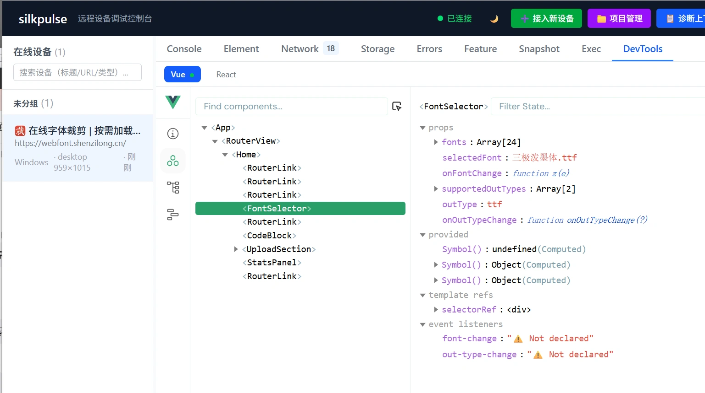
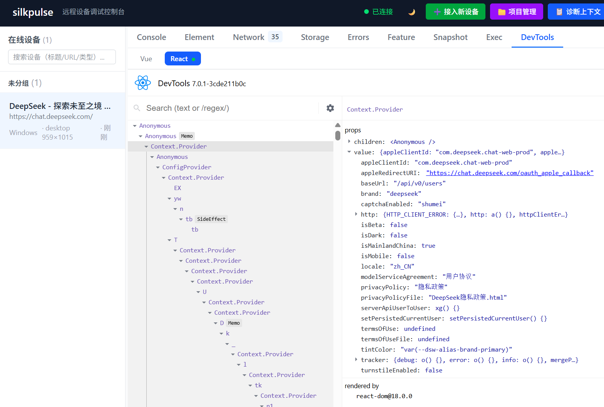

<div align="center">

# 🩺 silkpulse

### 让 AI 亲手调试你看不见的页面

线上 H5 · 移动端 webview · 用户现场 —— 任何打不开本地 DevTools 的远程页面

[](https://github.com/2234839/silkpulse/actions/workflows/ci.yml)
[](LICENSE)
[](https://silkpulse.heartstack.space)

Vue / React 组件树 · console · network · errors · source map · exec · AI skill

</div>

---

> 用户在千里之外的 iPhone 上说「页面白屏了」。
> 你对 AI 说一句「看看怎么回事」——它展开组件树、读 console、查网络请求，
> 定位到那行报错，执行代码验证，全程不需要用户装任何东西。
>
> **这就是 silkpulse 做的事。**

<p align="center">
  
  
</p>

<p align="center"><sub>远程页面跑的是生产构建？没关系 —— 组件树、hooks、state、props、源码位置，一个 script 标签接入直接看</sub></p>

## 核心亮点

- 🔭 **远程组件树** —— 官方 vue-devtools / react-devtools 面板内嵌：树形浏览、hooks / props / 源码定位；Vue DOM 变化自动广播、React 按官方节奏轮询跟随，生产构建可用
- 🤖 **AI-native 闭环** —— skill + HTTP API 双接入：AI 能看（快照 / 日志 / 网络 / 组件树）、能动（exec / click / type）、能闭环（诊断 → 操作 → 验证一气呵成）
- 📦 **零门槛接入** —— script 标签 / bookmarklet / userscript 三选一，线上站不改一行源码也能接
- 🛡 **生产级可靠** —— 断线重连（历史保留）、SDK 离线缓冲、自动 source map 解析、日志限流、错误风暴去重、WS 背压保护

## 在线体验

- **控制台**：[https://silkpulse.heartstack.space](https://silkpulse.heartstack.space)（输入密钥或以访客身份登录）
- **测试页**（已接入 SDK，可直接在控制台中看到）：[https://silkpulse.heartstack.space/test-page.html](https://silkpulse.heartstack.space/test-page.html)

## 与同类工具对比

> 一句话定位：PageSpy 的远程多端调试能力 + vite-plugin-pilot 的 AI-native 注入式哲学。

| | PageSpy | chii | vite-plugin-pilot | **silkpulse** |
|---|---|---|---|---|
| 远程设备调试 | ✅ | ✅ | ❌（仅本地 dev server） | ✅ |
| 远程组件树（Vue/React） | ❌（DOM 树） | ❌（DOM 树） | ❌ | ✅ 官方 DevTools 面板内嵌 |
| AI-native | ❌ | ❌ | ✅ | ✅ |
| AI 接入方式 | 无 | 无 | MCP | **skill + HTTP API** |
| 多设备并发 | ✅ | ✅ | ❌ | ✅ |
| 断线重连 | — | — | — | ✅（历史保留） |
| 前端依赖 | 自研控制台 | fork DevTools | 无控制台 | 自研轻量控制台 |

## 核心能力

### ✨ 远程组件树调试（DevTools）

线上页面是生产构建、没有本地 DevTools？**组件树照样看**：

- **Vue 3**：组件树 + 选中组件的 state / props，**DOM 变化自动刷新**（MutationObserver 监听重渲染，生产构建无框架事件也能自动广播树 + 状态）
- **React 18/19**：组件树 + 选中组件的 **hooks（State/Effect/Ref…）/ props / 源码定位**，选中后按官方 1s 轮询自动跟随更新
- **后注入也能恢复**：SDK 后于页面加载注入时，自动扫描 FiberRoot / Vue 实例重建组件树（不要求 script 必须在框架之前）
- **生产构建安全**：React 生产包不重放组件函数（hooks 直接读 fiber 内部链，杜绝 Invalid hook call #321）；无 `_debugSource` 时优雅降级
- **官方面板内嵌**：vue-devtools / react-devtools 官方 frontend 走 iframe 隔离加载，树形浏览、搜索、展开、选中体验与本地 DevTools 一致

### 远程采集
- **console 劫持**：info/warn/error/debug 全级别采集，安全序列化（限深限长防卡死），**日志限流**（滑动窗口 50 条/秒，防 log 爆炸打爆 WS/server；error 级不限流）
- **network 采集**：fetch + XHR 劫持，HAR 风格（URL/方法/状态/**关键请求头/响应头**/请求体/响应体/耗时）。headers 只采诊断关键头（content-type/authorization/cookie/自定义 x-* 等），鉴权/cookie 脱敏保留类型。**请求体双路采集**（init.body + `fetch(new Request(url, {body}))` 场景从 Request.clone() 读取，不丢失 body）。**FormData body 字段名采集**（列出字段名 + 文件字段文件名，如 `[FormData: username, avatar=<profile.png>]`，诊断表单提交/文件上传不丢字段信息）。**XHR responseType 全模式兼容**（json/arraybuffer/blob/document 模式下 responseText 抛 InvalidStateError，改用 response 读取——json 序列化、二进制标记类型+大小，不丢失响应体）
- **error 捕获**：window.onerror + unhandledrejection，含堆栈 + **自动 source map 解析**（压缩位置 → 原始源码位置，让 AI 能定位压缩代码的真实出错点）。**资源加载失败不计入 errorCount**（404 图片/脚本降级为快照附带提示，避免红条误导诊断）。**错误风暴去重**（循环错误——rAF/setInterval 里持续抛同一个错——首现立即上报，后续相同错误聚合计数，2s 窗口结束发一条"重复 N 次"汇总；不同错误全量实时上报。errorCount 始终反映真实总数，errors 条目保持精简，防 WS/server 被错误风暴打爆）
- **compact 快照**：移植自 pilot 的 AI 友好文本格式，稳定索引，~400 字符压缩整页状态，穿透 shadow DOM + 同源 iframe。**头部含视口尺寸**（`# viewport: 375×667`，AI 诊断响应式/布局错乱时知道当前可视区域是手机/平板/桌面）。**全量表单状态**（disabled/readonly/required/indeterminate/aria-disabled/aria-expanded/**当前聚焦元素 focus**）—— AI 诊断"按钮点不了""表单提交失败""光标在哪"时能直接定位根因。**select 选项 value:text 双标注**（`<bj:北京|sh:上海|gz:广州>`，AI 知道每个选项的 value 用于操作 + label 用于语义理解）

### AI 操作（exec 通道）
AI 在远程设备执行任意诊断 JS，内置辅助函数：
- `__silkpulse_click(idx)` — 点击快照中的元素（触发完整鼠标事件序列，覆盖监听 mousedown 的自定义组件）
- `__silkpulse_setValue(idx, val)` — 设置表单值（框架兼容，**支持 input/textarea/select/checkbox/radio**；checkbox 传 `true`/`false` 勾选/取消，radio 选中并自动取消同组互斥）
- `__silkpulse_type(idx, text)` — 模拟键盘逐字输入（触发 keydown/keyup，**React/Vue 受控组件兼容**——用原生 setter 累加 value，绕过框架对 `el.value` 的 setter 覆盖）
- `__silkpulse_scroll(idx, x, y)` — 滚动元素内部（idx<0 时滚动整个窗口），触发懒加载/检查 sticky
- `__silkpulse_scrollIntoView(idx, block?)` — 滚动元素到可视区域（居中/顶部/底部）
- `__silkpulse_hover(idx)` — 鼠标悬停（触发 mouseover/mouseenter），展开下拉菜单/tooltip
- `__silkpulse_pressKey(idx, key, mods?)` — 按键（Enter/Escape/方向键/快捷键，派发 keydown+keyup；idx<0 对当前焦点元素；mods 可选修饰键）
- `__silkpulse_wait(ms)` — 异步等待
- `__silkpulse_snapshot()` — 手动取快照
- `__silkpulse_sourcemap(line, col, sourceUrl?)` — 解析 source map，压缩位置 → 原始源码位置
- `__silkpulse_sourcemapStack(frames[])` — 批量解析堆栈帧
- `__silkpulse_storage(type?)` — 查询 localStorage/sessionStorage/cookie（返回 `{key:value}`，诊断登录态/会话/配置异常）

### 多形态接入
- **script 标签**：能改源码时
- **bookmarklet**：线上站不便改源码时，拖到书签栏点击即接入
- **userscript**：Tampermonkey/Greasemonkey，自动匹配所有页面

### 设备标签 / 备注
多设备场景下区分"哪台是哪台"：
- **接入时预设**：`<script src=".../sdk.js" data-tags="生产,用户A" data-note="iPhone 15"></script>`
- **运行时修改**：控制台 UI 内联编辑（选中设备点 🏷️），或 `POST /api/devices/:id/tags`
- **AI 可用**：`silkpulse tag <id> "标签1,标签2" 备注内容`
- **持久保留**：SPA 路由变化、断线重连都不覆盖 server 侧标签

### 可靠性
- **断线重连**：指数退避（1s/2s/4s...30s），重连后历史缓冲区完整保留；**重连定时器跟踪 + disconnect 清理**（页面卸载/重新初始化时 clearTimeout，防止已调度的重连在卸载后建立幽灵 WS 连接）
- **SDK 离线缓冲**：启动期间（采集器装好到 WS 连上）和断线期间产生的日志/错误/网络请求，暂存 SDK 内存队列（上限 200 条），重连后 flush，不丢失早期错误
- **SPA 路由感知**：pushState/replaceState/popstate 上报 URL 变化
- **视口变化感知**：窗口缩放/移动端旋转时上报新 viewport + 重新推断设备类型（防抖 300ms），诊断横屏布局错乱时 AI 能看到真实视口
- **环形缓冲区**：server 内存保留最近 500 条日志 / 100 条网络 / 50 条错误
- **静态资源缓存**：sdk.js/index.html 强制 no-cache（诊断工具不能用旧版），带 hash 的构建产物长缓存 + ETag 304（正确识别 Vite base64url hash，含 `-`/`_` 字符）
- **WS 背压保护**：broadcast 检查 `bufferedAmount`，慢客户端（VPN/弱网）积压超 1MB 时自动关闭该连接，防止单个慢消费者拖垮 server 内存；send 带回调避免竞态抛异常
- **exec 异步超时**：永不 resolve 的代码（如 `new Promise(() => {})`）由 SDK 端 9s 超时兜底（早于 server 10s），干净回传 + 释放 exec 日志捕获队列，不靠 server 干等导致 promise 泄漏；**正常完成时 clearTimeout 清理超时定时器**，避免超时 promise reject 触发 unhandledrejection 被 error-catcher 误报为设备错误；**设备掉线时 server 立即 reject 所有 pending exec + clearTimeout**（pendingExecs 存 `{resolve, timer}`，掉线不等 10s 超时，定时器不泄漏）；**exec 日志截断**（exec 代码产生海量日志时——如 for 循环 console.log 10 万次——保留头部前 100 条 + 尾部后 100 条 + 中间省略标注，防 WS 消息帧撑爆）
- **HTTP body 上限**：POST body 超 2MB 返回 413（诊断代码实际几 KB，留充足余量），防止超大/恶意请求撑爆内存；客户端中断时 readBody 正常 resolve 不泄漏 promise
- **最近下线设备历史**：设备掉线后保留摘要到 `recentlyOffline`（上限 10，含下线时刻/URL/错误数），AI 调 `/api/devices` 能区分"从未接入"和"接入过但掉了"，不误判诊断方向；重连后自动移除

## 架构

```
远程设备 (被调试页面)
  │  silkpulse SDK (注入)  ← <script src="http://server/sdk.js">
  │   · console/network/error 采集
  │   · compact 快照 (移植 pilot)
  │   · exec 通道 (接收指令 → eval → 回传)
  └──────────┬──────────
         WebSocket (上报 + 接收指令)
             ▼
silkpulse server (Node + TS)
  · 设备注册表 + 环形缓冲区
  · WS 中转：设备 ↔ 控制台
  · HTTP API：AI skill 调用入口
  · 静态 serve：控制台 UI + SDK
      ├── HTTP API ──→ AI agent (skill)
      └── WebSocket ──→ 控制台 UI (Vue3 + Tailwind)
```

## 快速开始

### 构建

```bash
vp install
vp run -r build    # 构建所有包并复制产物到 server/public
```

### 启动 server

```bash
vp run start    # 默认端口 8080
# 或 node packages/server/dist/bin/silkpulse.mjs --port 3000
```

### 部署到生产

构建后只需要三个产物目录，无需 `node_modules`（ws 等依赖已通过 `vite.config.ts` 的 `pack.deps.alwaysBundle` 打包进 bundle）：
- `packages/server/dist/` — server bundle（含 `bin/silkpulse.mjs` 入口）
- `packages/server/public/` — 控制台 UI + SDK（`sdk.js`）
- `examples/test-page.html` — demo 测试页

#### 方式一：直接用 Node 运行

```bash
vp run -r build

# 上传到服务器
rsync -avz --delete packages/server/dist/   root@<server>:/app/silkpulse/dist/
rsync -avz --delete packages/server/public/ root@<server>:/app/silkpulse/public/
rsync -avz examples/test-page.html          root@<server>:/app/silkpulse/examples/

# 在服务器上启动（用 PM2 / systemd 管理进程）
SILKPULSE_ADMIN_KEY=<你的密钥> node /app/silkpulse/dist/bin/silkpulse.mjs --port 8080
```

#### 方式二：Docker

```bash
vp run -r build
docker build -t silkpulse .
docker run -d -p 8080:8080 -e SILKPULSE_ADMIN_KEY=<你的密钥> -v ./data:/data silkpulse
```

Dockerfile 示例：

```dockerfile
FROM node:24-alpine
WORKDIR /app
COPY packages/server/dist/     /app/dist/
COPY packages/server/public/   /app/public/
COPY examples/test-page.html   /app/examples/test-page.html
ENV NODE_ENV=production
ENV SILKPULSE_DATA_DIR=/data
CMD ["node", "/app/dist/bin/silkpulse.mjs", "--port", "8080"]
```

#### 环境变量

| 变量 | 说明 |
|---|---|
| `SILKPULSE_ADMIN_KEY` | 超管密钥（鉴权用，**必设**） |
| `SILKPULSE_DATA_DIR` | 数据目录（默认 `/data`） |
| `--port` | 监听端口（默认 `8080`） |

#### 反向代理

Nginx 反代到 server 端口，确保 WebSocket 升级：

```nginx
proxy_set_header Upgrade $http_upgrade;
proxy_set_header Connection $http_connection;
proxy_set_header X-Forwarded-Proto $scheme;
```

> 接入代码（script/bookmarklet/userscript）的 server 地址会**根据请求 Host 头自动生成**，无需手动修改。

### 接入远程设备

**方式一：script 标签**（最常用，能改源码时）

```html
<script src="http://localhost:8080/sdk.js" data-server="http://localhost:8080"></script>
```

**方式二：bookmarklet**（线上站不便改源码时）

访问 `http://localhost:8080/inject/bookmarklet`，将输出的 `javascript:` 链接拖到浏览器书签栏，在任意页面点击即接入。

**方式三：userscript**（Tampermonkey/Greasemonkey）

访问 `http://localhost:8080/inject/userscript`，保存为 `.user.js` 安装到油猴，自动匹配所有页面注入。

### AI 接入（skill）

AI agent 通过 silkpulse skill 操作设备：

```bash
# 1. 查看在线设备（有错误的自动置顶）
node tools/skill/scripts/silkpulse.mjs devices

# 2. 取页面快照（AI 友好的 compact 文本）
node tools/skill/scripts/silkpulse.mjs snapshot <id>

# 3. 执行诊断代码（支持 stdin 传复杂多行代码）
echo 'return { title: document.title, url: location.href }' | node tools/skill/scripts/silkpulse.mjs exec <id>

# 4. 查看错误 / 日志 / 网络
node tools/skill/scripts/silkpulse.mjs errors <id> 5         # 最近 5 条错误（每条带 stack，省 token）
node tools/skill/scripts/silkpulse.mjs logs <id> 20          # 最近 20 条日志（省 token，AI 常用）
node tools/skill/scripts/silkpulse.mjs network <id>   # 含关键请求头/响应头

# 一键诊断聚合（错误 + 失败网络 + 慢请求 + WebSocket 连接 + 日志 + 快照，AI 最高效入口）
node tools/skill/scripts/silkpulse.mjs inspect <id>

# 5. 生成接入片段
node tools/skill/scripts/silkpulse.mjs inject bookmarklet
```

详见 [tools/skill/SKILL.md](tools/skill/SKILL.md)。

### 控制台 UI

浏览器打开 `http://localhost:8080` —— Vue3 + Tailwind 的设备调试控制台（**Tab 数量徽标**：Console/Network/Errors tab 实时显示条数，Errors 有错误时红色高亮，一眼定位问题面板）：

- **设备列表**：搜索筛选、设备类型图标（📱手机/📲平板/🖥️桌面）、错误红条高亮、**在线时长**（"刚刚"/"3 分钟"/"1 小时"，30 秒刷新，判断问题持续性）
- **Console 面板**：级别筛选（全部/ERROR/WARN/INFO/DEBUG，**选中态语义色**——error 红/warn 橙/info 蓝，按钮显示各级别条数）+ 关键词搜索 + **自动滚动到最新**（智能：向上翻看历史时不强制拉回）+ **清空视图**（🚫 隐藏当前日志专注新产生，server 缓冲不变）+ **点击复制单条日志**（hover 高亮 + ✓ 反馈，长消息自动换行不截断）
- **Network 面板**：主从布局，**时间戳列**（与 console 日志交叉对比时序），点击请求查看请求体/响应体详情，**一键复制为 cURL**（远程请求本地/AI 复现），URL/方法/状态码搜索过滤，**状态筛选**（全部/成功/失败，快速隔离 4xx/5xx 异常请求），**耗时排序**（点击"耗时"表头三态切换：时间序/降序/升序，慢请求 >500ms 橙色高亮，一眼定位性能瓶颈，与 inspect CLI 慢请求 Top 对齐）
- **Errors 面板**：含堆栈展示（可折叠）+ source map 解析后的原始源码位置，message/堆栈/源码位置搜索过滤，**单条错误一键复制**（格式化 message + 源码位置 + stack，粘贴给 AI/同事），**复制全部错误**（一键聚合当前过滤后的所有错误为文本，对齐 inspect CLI 格式，AI 需完整错误现场时批量获取）
- **Snapshot 面板**：compact 文本格式，**行级搜索过滤**（输入元素名/idx/状态 token 只显示匹配行，快速定位），**一键复制**（粘贴给 AI/存档），带刷新按钮
- **DevTools 面板**：远程页面 **Vue / React 组件树**（官方 frontend 内嵌 iframe）——树形浏览 + 搜索，点选组件看 state / hooks / props / 源码位置，数据变化自动刷新（Vue MutationObserver 广播 / React 官方轮询），生产构建可用；⟳ 手动刷新（React 侧重载面板，树恒单份）
- **Exec 面板**：直接执行诊断 JS（Ctrl+↵，**Tab 缩进 / Shift+Tab 反缩进**，支持多行选区批量缩进/反缩进），**执行结果分块展示**（返回值 + 执行期间日志分开，失败红色高亮），**执行后快照默认折叠**（点击展开，不挤占返回值视线），**执行历史侧栏**（点击回填，localStorage 持久化）
- **✨ AI 诊断上下文**：一键聚合错误+快照+网络+日志为 markdown，复制给任意 AI agent
- **🌙/☀️ 深色模式**：跟随系统偏好，localStorage 持久化

## 项目结构

```
silkpulse/
├── packages/
│   ├── shared/          # 共享协议类型（device/console/server 三方消息契约）
│   ├── server/          # Node server：WS 中转 + HTTP API + 静态资源
│   └── sdk/             # 注入 SDK（IIFE 单文件）：采集 + exec + 重连
├── apps/
│   └── console/         # Vue3 + TS + Tailwind 控制台 UI
├── tools/
│   └── skill/           # AI skill：SKILL.md + CLI 脚本
├── examples/
│   └── test-page.html   # 测试页（含交互/搜索/网络/错误场景）
└── scripts/
    └── headless-test.mjs # 无头浏览器端到端测试（94 项）
```

整个项目用 [VitePlus](https://viteplus.dev/) 统一管理 —— `vp pack` 打包库、`vp build` 构建应用、`catalog:` 统一版本。

## HTTP API

| 方法 | 路径 | 作用 |
|---|---|---|
| GET | `/api/devices` | 在线设备 + 最近下线设备（`{ devices, recentlyOffline }`） |
| GET | `/api/devices/:id/snapshot` | compact 快照（text/plain，AI 直接读） |
| POST | `/api/devices/:id/exec` | 在设备页面执行 JS（`{code: "..."}`） |
| GET | `/api/devices/:id/logs?since=N` | console 日志（游标分页） |
| GET | `/api/devices/:id/network?since=N` | network 记录（HAR 风格，游标分页） |
| GET | `/api/devices/:id/errors?since=N` | 错误记录（游标分页） |
| POST | `/api/devices/:id/tags` | 修改设备标签/备注（`{tags?: string[], note?: string}`） |
| GET | `/inject/bookmarklet` | 生成 bookmarklet 注入片段 |
| GET | `/inject/userscript` | 生成 userscript 注入片段 |
| POST | `/api/echo` | 回显端点（测试 POST body 采集） |

## 端到端测试

```bash
# 类型检查
vp check

# 启动 server
node packages/server/dist/bin/silkpulse.mjs --port 8083

# 运行无头测试（puppeteer-core + 系统 chromium）
SILKPULSE_SERVER=http://localhost:8083 vp test
```

CI（GitHub Actions）在每次 push/PR 时自动运行类型检查 + 构建 + 94 项无头测试，见 [.github/workflows/ci.yml](.github/workflows/ci.yml)。

73 项测试覆盖：控制台 UI 渲染、SDK 连接、设备类型识别、SPA 路由上报、exec/snapshot/click/type（**__silkpulse_type 用原生 setter 兼容 React 受控组件**）/setValue（**支持 select + checkbox/radio，radio 选中时手动取消同组互斥**——合成事件不触发浏览器 pre-click 默认行为，互斥需自行实现；快照 options value:text 双标注）/scroll/scrollIntoView/hover、快照表单状态采集（含当前聚焦元素）、**快照头部含视口尺寸**（viewport W×H，诊断响应式布局）、exec 错误含 stack、exec 异步超时保护（永不 resolve 的代码 9s 兜底）、**exec 日志截断保护**（海量日志保留头尾 + 省略标注，防 WS 消息撑爆）、**设备掉线时 pending exec 立即失败**（server 不等超时直接 reject + 定时器清理）、console 采集、日志限流、**连续重复日志聚合**（循环/spam 相同日志聚合成一条 + repeat 计数，避免占满缓冲区挤掉有价值的诊断日志，与 Chrome DevTools ⓧN 一致）、network 采集（含 POST body + 关键请求头/响应头 + **XHR responseType=json 响应体兼容** + **Request 对象 body 采集** + **FormData body 字段名采集**（字段名 + 文件名，诊断表单/文件上传不丢字段信息）+ **WebSocket 采集**（劫持 WS 构造函数，连接/send/recv/close 帧时间线，Blob 消息异步读取文本，对齐 DevTools WS Messages 面板））、**echo 端点非 JSON body 不崩溃**（FormData multipart 等非 JSON body 优雅返回文本而非 crash server）、HTTP body 上限保护（超大 POST 返回 413）、error 采集、资源加载失败不计入 errorCount、**错误风暴去重**（循环错误首现秒到、后续聚合"重复 N 次"汇总，不同错误全量上报，与 log 限流形成两道防线）、WS 实时推送、多设备并发、设备搜索、AI 诊断上下文、bookmarklet 注入、断线重连（历史保留）、**连续断线重连稳定性**（定时器泄漏回归）、WS broadcast 背压保护（慢客户端不拖垮 server）、SDK 离线缓冲（断线期间数据不丢失）、最近下线设备历史（AI 区分"没接入"vs"接入过但掉了"）、设备标签/备注、source map 解析、iframe 元素采集、错误堆栈折叠 + 搜索过滤、**单条错误一键复制**（格式化 message + 源码位置 + stack）、**复制全部错误**（聚合当前过滤后的错误为文本，对齐 inspect CLI 格式）、Tab 数量徽标（Errors 红色高亮）、exec 执行历史、复制为 cURL、network 列表时间戳列、**network 详情 JSON body 格式化**（请求体/响应体为 JSON 时自动美化缩进，压缩 JSON 可读性极差）、**skill CLI errors/logs/network --tail**（三数据通道统一范围参数，AI 省 token）、skill CLI（network headers + inspect 聚合含日志段 + **WebSocket 连接段**（WS 条目独立展示，状态/收发帧数/error 事件，不再被误归入失败网络） + **失败请求响应体**（诊断 4xx/5xx 的错误原因））、深色模式、Network 状态筛选（全部/成功/失败三态隔离异常请求）、Console 清空视图（隐藏当前日志，新日志正常出现）、**Console 日志点击复制单条**（hover 高亮 + ✓ 反馈 + 长消息自动换行）、SDK 视口变化上报（resize/旋转后 server 收到新 viewport）、Snapshot 面板搜索过滤 + 一键复制、设备在线时长展示（UI + skill CLI）、Console 级别筛选语义色 + 计数、Network 耗时排序（三态切换 + 慢请求高亮）、AI 诊断上下文含慢请求段（控制台按钮与 inspect CLI 输出对齐）、**exec 编辑器 Tab/Shift+Tab**（单行缩进/反缩进 + 多行选区批量缩进/反缩进，v-model 双向绑定下用 nextTick 恢复光标/选区）、**exec pressKey 键盘交互**（Enter 提交 / Escape 清空 / idx<0 对 activeElement 按键，派发 keydown+keyup 覆盖主流框架）、**快照序列化截断阈值提升**（serializeResult 4K→20K，页面元素增多后完整快照 JSON 不再被截断导致解析失败，同时仍挡住 `return document` 失误）。

## License

MIT
